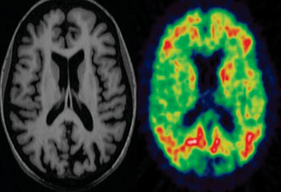

# Introduction

Late-onset Alzheimer’s disease (LOAD) is the most prevalent form of dementia, characterized by progressive cognitive decline, memory loss, and severe neurodegeneration. Despite extensive research, the molecular mechanisms underlying LOAD remain only partially understood. While hallmark features such as beta-amyloid plaques and neurofibrillary tangles are well-documented, broader transcriptomic alterations that drive disease progression require further investigation.

High-throughput RNA sequencing (RNA-Seq) has revolutionized the study of neurodegenerative diseases by enabling the comprehensive profiling of gene expression at an unprecedented resolution. This approach not only facilitates the identification of differentially expressed genes but also provides insights into regulatory pathways and novel RNA species, such as long non-coding RNAs (lncRNAs), which are increasingly implicated in neuronal function and dysfunction.

For this analysis, publicly available RNA-Seq data from hippocampal samples of LOAD patients and age-matched controls were utilized, originally published by *[@magistri_2015]*. The hippocampus, a region critical for learning and memory, is one of the first to be affected in Alzheimer’s disease, making it a key target for studying disease pathology. The original study highlighted significant transcriptomic alterations, including disruptions in neurovascular integrity, beta-amyloid clearance pathways, and widespread dysregulation of lncRNAs.

Building upon these findings, this analysis aimed to identify differentially expressed genes, validate previously reported molecular signatures, and explore new potential LOAD-related mechanisms. Notably, genes such as SERPINE1 and VGLL3 were identified as significantly differentially expressed, reinforcing prior evidence on their role in LOAD pathology. The results underscore the value of transcriptomic studies in uncovering molecular drivers of disease and provide a foundation for further experimental validation and therapeutic exploration.

```{r, echo=FALSE, fig.cap="MRI and PET scans of a patient with Alzheimer’s disease. Edison, P. Neurology Imaging Unit, Centre for Translational Imaging, Imperial College London). Rerieved from \\href{https://www.medimaging.es/medicina-nuclear/articles/294756318/combinan-pet-y-rm-para-visualizar-desarrollo-de-alzheimer.html}.", out.width="50%", out.height="60%", fig.align="center"} 

```

# Research question

This analysis seeks to determine which genes are differentially expressed in the hippocampus of late-onset Alzheimer’s disease (LOAD) patients compared to age-matched controls. By identifying transcriptomic alterations, the goal is to gain insight into potential molecular mechanisms associated with the disease.


# Objectives: 

**General objective** 

To identify differentially expressed genes associated with late-onset Alzheimer’s disease (LOAD) using RNA-Seq data from hippocampal samples, and to explore their potential roles in the molecular mechanisms underlying the disease.

**Specific objectives** 

- To preprocess and normalize RNA-Seq count data using appropriate bioinformatics pipelines.
- To perform differential expression analysis to identify genes significantly associated with LOAD compared to age-matched controls.
- To integrate biological interpretation of key genes, including protein-coding and long non-coding RNAs (lncRNAs), based on literature and functional annotations.
- To visualize and present the results through plots and heatmaps to provide clear insights into the transcriptomic differences between control and LOAD samples.


# Methodology 

# 1.1 Selection and collection of data 

In this section, the analysis was initiated by leveraging the recount3 database, which contains preprocessed RNA-Seq data from various studies. Using the ***available_projects()*** function, all human datasets were retrieved to explore potential projects for analysis. The ***interactiveDisplayBase*** package provides an easy-to-use interface to examine metadata and select a dataset aligned with the research objectives.

```{r load_libraries, include=TRUE, message=FALSE}
# Load required libraries
# recount3: Provides access to recount3 data repository.
# interactiveDisplayBase: Allows an interactive visualization of available projects.
library("recount3")
library("interactiveDisplayBase")
```

```{r interactive_interface, include=TRUE, eval=TRUE}
# Retrieve available human RNA-Seq projects from recount3
# This function lists all projects available for analysis.
human_projects <- available_projects()

# Display the list of projects interactively
# Use this to explore the datasets and select one relevant to your research question.
#interactiveDisplayBase::display(human_projects)
```


# 1.2 Data proccesing 

In this step, the RNA-Seq data associated with project SRP056604 from the recount3 database was extracted. The ***create_rse function*** structures the raw data into a ***RangedSummarizedExperiment*** object, which facilitates downstream analysis. Assigned read counts were calculated using the ***compute_read_counts*** function, ensuring the data is ready for normalization and differential expression analysis. Lastly, the presence of the "counts" matrix were verified, confirming successful computation.

```{r summarized_object, echo=TRUE, message=TRUE, warning=TRUE, error=TRUE}
# Create a RangedSummarizedExperiment object
# This function extracts and structures the RNA-Seq data for project SRP056604.
# "data_sources" refers to the type of dataset we are analyzing.
rse_gene_SRP056604 <- create_rse(
    subset(
        human_projects,
        project == "SRP056604" & project_type == "data_sources"
    )
)

# Verify that the data has been successfully loaded
# This displays metadata about the loaded dataset.
rse_gene_SRP056604
```

```{r read_counts, echo=TRUE, message=TRUE, warning=TRUE, error=TRUE}
# Compute assigned read counts
# The counts represent the number of reads mapped to genes in the dataset.
assay(rse_gene_SRP056604, "counts") <- compute_read_counts(rse_gene_SRP056604)

# Confirm that the read counts have been calculated
# The "counts" matrix should now be accessible within the RangedSummarizedExperiment object.
assayNames(rse_gene_SRP056604)
```


# 1.3 Quality control and data cleaning

In this section, the metadata associated with the dataset was standardized. First, the initial entries of the ***sra.sample_attributes*** were inspected to identify potential issues, such as missing or inconsistent values. The next step was to replace occurrences of "Not available" in the "apoe genotype" field with NA, a standard placeholder for missing data in R. This step ensures that the dataset is clean and ready for subsequent analysis, minimizing errors caused by non-standard missing value formats.

```{r first_attributes, echo=TRUE, message=TRUE, warning=TRUE, error=TRUE}
# Display the first sample attributes
# This step allows inspection of the first 8 entries in the sample attributes, 
# focusing on metadata to identify missing or inconsistent information.
rse_gene_SRP056604$sra.sample_attributes[1:8]
```

```{r filtering_samples, echo=TRUE, message=TRUE, warning=TRUE, error=TRUE}
# Filter samples with missing information in the "apoe genotype" attribute
# Replace "Not available" with NA to standardize missing values for downstream processing.
rse_gene_SRP056604$sra.sample_attributes <- gsub(
    "apoe genotype;;Not available",
    "apoe genotype;;NA",
    rse_gene_SRP056604$sra.sample_attributes
)
```

```{r filtered_samples, echo=TRUE, message=TRUE, warning=TRUE, error=TRUE}
# Verify the updated attributes after filtering
# Inspect the first 8 attributes again to confirm the replacements were made.
rse_gene_SRP056604$sra.sample_attributes[1:8]
```


In this step, the metadata embedded within the SRA attributes was expanded using the ***expand_sra_attributes function***. This allowed for a clearer representation of key variables, which are crucial for accurate data interpretation. The second line of code verifies the proper expansion by identifying and displaying columns labeled with ***sra_attribute***, ensuring that all necessary metadata is accessible for subsequent analyses.

```{r expand_attributess, echo=TRUE, message=TRUE, warning=TRUE, error=TRUE}
# Expand SRA attributes
# This function processes and expands metadata stored within the SRA attributes of 
# the dataset, making it more accessible for downstream analysis.
rse_gene_SRP056604 <- expand_sra_attributes(rse_gene_SRP056604)

# Display columns containing SRA attributes
# Identify and inspect columns in the dataset metadata that contain "sra_attribute" 
# to confirm proper expansion of the attributes.
colData(rse_gene_SRP056604)[
    , grep("^sra_attribute", colnames(colData(rse_gene_SRP056604)))
]
```


This block focuses on ensuring the data types of key attributes are correctly assigned, which is essential for accurate analysis and modeling. Initially, the structure of the relevant columns was inspected to identify any necessary changes. Subsequently, specific attributes were converted to the appropriate types, such as character or factor, depending on their intended use. For instance:

- ***apoe_genotype*** was kept as character since it is not involved in the model.
- ***braak_stage was*** converted to a factor with specified levels to reflect its ordered nature.
- ***gender was converted*** to a factor with standardized lowercase values.

The final step provides a summary of the modified columns, verifying that the data is now clean and ready for further processing.

```{r check_data, echo=TRUE, message=TRUE, warning=TRUE, error=TRUE}
# Check data types of relevant columns
# Display the structure of columns containing SRA attributes to ensure the data 
# types are appropriate.
str(as.data.frame(colData(rse_gene_SRP056604)[
  ,
  grepl("^sra_attribute", colnames(colData(rse_gene_SRP056604)))
]))
```

````{r convert_data, echo=TRUE, message=TRUE, warning=TRUE, error=TRUE}
# Convert specific attributes to the appropriate type
# Modify data types as required for downstream analysis.
rse_gene_SRP056604$sra_attribute.apoe_genotype <- 
  as.character(rse_gene_SRP056604$sra_attribute.apoe_genotype)  
# Keep as character if not used in the model

rse_gene_SRP056604$sra_attribute.braak_stage <- factor(
  rse_gene_SRP056604$sra_attribute.braak_stage, 
  levels = c("I", "II", "V", "VI")
) 
# Assign explicit levels for ordered data

rse_gene_SRP056604$sra_attribute.gender <- factor(
  tolower(rse_gene_SRP056604$sra_attribute.gender)
)  
# Convert to factor with lowercase values

rse_gene_SRP056604$sra_attribute.source_name <- 
  as.character(rse_gene_SRP056604$sra_attribute.source_name)  
# Maintain as text

rse_gene_SRP056604$sra_attribute.subject_group <- factor(
  rse_gene_SRP056604$sra_attribute.subject_group
) 
# Convert to factor

rse_gene_SRP056604$sra_attribute.tissue <- factor(
  rse_gene_SRP056604$sra_attribute.tissue
) 
# Convert to factor
````

````{r sumarrize_attributes, echo=TRUE, message=TRUE, warning=TRUE, error=TRUE}
# Summarize updated attributes
# Display a summary of SRA attribute columns to confirm proper conversion and organization.
summary(as.data.frame(colData(rse_gene_SRP056604)[
  ,
  grepl("^sra_attribute", colnames(colData(rse_gene_SRP056604)))
]))
````


In this step, the proportion of assigned gene counts was calculated for each sample. This proportion provides an indicator of data quality, as it reflects how efficiently reads were assigned to genes in the dataset. A higher proportion suggests better data quality, as it indicates a lower number of unassigned reads. This information can later be used to filter low-quality samples or outliers, ensuring that downstream analyses are reliable.

````{r calcule_proportion, echo=TRUE, message=TRUE, warning=TRUE, error=TRUE}
# Calculate the proportion of assigned gene counts
# This metric helps evaluate the quality of the data by determining the proportion
# of total reads assigned to genes for each sample.
rse_gene_SRP056604$assigned_gene_prop <- 
    rse_gene_SRP056604$recount_qc.gene_fc_count_all.assigned /
    rse_gene_SRP056604$recount_qc.gene_fc_count_all.total
````


This section focuses on visualizing the quality of the samples based on the proportion of assigned genes.

- A boxplot was created to illustrate the relationship between subject groups (controls and Alzheimer’s patients) and the proportion of assigned genes. This visualization helps assess whether there are significant differences between groups in terms of data quality.
- A histogram was generated to evaluate the distribution of the proportion of assigned genes across all samples, highlighting any potential outliers or poorly sequenced samples.
- Samples with a proportion of assigned genes lower than 0.3 were flagged for potential exclusion. The filtering results are summarized using a contingency table.

```{r echo=TRUE, fig.align='center', fig.cap="Boxplot of controls and LOAD patients", fig.height=4, fig.width=7}

# Load ggplot2 for visualization
library(ggplot2)

# Create a boxplot to examine the relationship between subject groups and the 
# proportion of assigned genes
ggplot(as.data.frame(colData(rse_gene_SRP056604)), aes(
  x = sra_attribute.subject_group, y = assigned_gene_prop
)) +
  geom_boxplot() +
  theme_bw(base_size = 10) +
  labs(
    x = "Subject group (control vs disease)",
    y = "Proportion of assigned genes",
    title = "Relationship between subject group and proportion of assigned genes"
  )

```


```{r summarize_differences, echo=TRUE, message=TRUE, warning=TRUE, error=TRUE}
# Summarize differences in assigned gene proportion by subject group
with(
  colData(rse_gene_SRP056604), 
  tapply(
    assigned_gene_prop, 
    sra_attribute.subject_group, 
    summary
  )
)
```

```{r echo=TRUE, fig.align='center', fig.cap="Histogram of the distribution of the proportion of assigned genes", fig.height=4, fig.width=7}

# Create a histogram to visualize the distribution of the proportion of assigned genes
hist(rse_gene_SRP056604$assigned_gene_prop,
     main = "Histogram of assigned gene proportion",
     xlab = "Proportion of assigned genes",
     ylab = "Frequency",
     col = "gray",
     border = "black")
```


In this part two samples had a proportion of assigned genes below 0.3, suggesting lower sequencing quality. Initially, the plan was to exclude these samples to maintain a consistent quality threshold. However, upon further investigation, it was determined that both samples belonged to the control group, which would have introduced a significant imbalance between the control and disease groups.

Given that our dataset consists of only 8 samples (4 controls and 4 disease cases), removing these two samples would have compromised the validity of downstream statistical analyses. To preserve the integrity of the experimental design, it was decided to retain all 8 samples.

```{r flagged_samples, echo=TRUE, message=TRUE, warning=TRUE, error=TRUE}
# Filter samples with an assigned gene proportion < 0.3 and show the count
table(rse_gene_SRP056604$assigned_gene_prop < 0.3)

# Decision: Retain all samples, including those flagged with < 0.3 proportion
```


The average expression level for each gene across all samples was calculated using the ***rowMeans()*** function. A statistical summary of the mean expression levels was obtained with the ***summary()*** function, highlighting key metrics such as the minimum, maximum, and quartiles. To ensure the ability to revert to the original dataset if needed, a copy of the unfiltered dataset was saved in the object ***rse_gene_SRP056604_unfiltered***. Genes with a mean expression level lower than 0.1 were then filtered out, as these are typically considered noise and are less likely to be biologically significant. The dimensions of the filtered dataset were checked using the ***dim()*** function to confirm the number of retained genes and samples. Additionally, the percentage of genes retained after filtering was calculated, yielding a value of 78.16%, indicating that a substantial proportion of biologically relevant genes were preserved while minimizing noise. 

```{r mean_expression, echo=TRUE, message=TRUE, warning=TRUE, error=TRUE}
# Calculate the mean expression level for each gene across all samples
gene_means <- rowMeans(assay(rse_gene_SRP056604, "counts"))

# Summarize the distribution of mean gene expression
summary(gene_means)
```

```{r expression_greater, echo=TRUE, message=TRUE, warning=TRUE, error=TRUE}
# Backup the original dataset before filtering (unfiltered dataset)
rse_gene_SRP056604_unfiltered <- rse_gene_SRP056604

# Filter genes with a mean expression level greater than 0.1
rse_gene_SRP056604 <- rse_gene_SRP056604[gene_means > 0.1, ]

# Check the dimensions of the filtered dataset (rows: genes, columns: samples)
dim(rse_gene_SRP056604)
```


```{r retained_genes, echo=TRUE, message=TRUE, warning=TRUE, error=TRUE}
# Calculate the percentage of genes retained after filtering
porcentaje_genes_retenidos <- round(nrow(rse_gene_SRP056604) / nrow(rse_gene_SRP056604_unfiltered) * 100, 2)

# Output the percentage of genes retained
porcentaje_genes_retenidos
```


# 1.4 Data normalization 

Normalization was performed using the edgeR package to account for differences in library sizes. A DGEList object was created to store the count data and gene metadata from ***rse_gene_SRP056604***. The normalization factors were calculated with ***calcNormFactors()***, ensuring that technical variations were minimized. The results were checked using ***dge$samples***, which showed library sizes and normalization factors.

```{r data_normalization, echo=TRUE, message=FALSE, warning=TRUE, error=TRUE}
# Load the edgeR library
library("edgeR")

# Create a DGEList object with count data and metadata
dge <- DGEList(
  counts = assay(rse_gene_SRP056604, "counts"),  # Add count data
  genes = rowData(rse_gene_SRP056604)           # Add gene metadata
)

# Calculate normalization factors to adjust for library size differences
dge <- calcNormFactors(dge)

# View the normalization factors and library sizes
dge$samples
```


# 1.5 Differential expression analysis: model construction 

The first step in the differential expression analysis involved creating a design ***matrix (mod)*** using the ***model.matrix()*** function. This matrix incorporates key variables: subject group, gender, and the proportion of assigned genes. These variables were selected to capture relevant biological and technical variability in the data. The columns of the design matrix were verified using ***colnames(mod)*** to ensure all terms were correctly specified.

```{r model_matrix, echo=TRUE, message=TRUE, warning=TRUE, error=TRUE}
# Construct the design matrix for differential expression analysis
mod <- model.matrix(~ sra_attribute.subject_group + sra_attribute.gender + assigned_gene_prop,
                    data = colData(rse_gene_SRP056604))

# Verify the columns of the model
colnames(mod)
```


# 1.5.1 Differential expression analysis: voom normalization 

The next step in the analysis utilized the voom function from the limma package to normalize the RNA-seq count data. 

The red line in the plot represents the smoothed mean-variance trend, and the scatterplot shows individual genes with their variability. The trend demonstrates a reduction in variability as the expression values increase, which is expected in properly normalized RNA-seq data.

```{r echo=TRUE, fig.align='center', fig.cap="Mean-variance trend plot", fig.height=4, fig.width=7}
# Load the limma library
library("limma")

# Apply voom normalization and generate the mean-variance trend plot
vGene <- voom(dge, mod, plot = TRUE)
```


# 1.5.2 Differential expression analysis: linear model and Bayesian statistics 

The analysis proceeds with fitting a linear model to the normalized data, followed by applying empirical Bayes moderation using eBayes. These steps enhance the stability of the variance estimates, which is crucial given the high-dimensional nature of RNA-seq data. The moderated statistics are used to identify differentially expressed genes.

The table of results contains key metrics, including fold changes, p-values, and adjusted p-values for all genes in the dataset. The dimensions of the results confirmed that 49,909 genes were analyzed across all samples.

```{r linear_model, echo=TRUE, message=TRUE, warning=TRUE, error=TRUE}
# Fit the linear model and apply empirical Bayes moderation
eb_results <- eBayes(lmFit(vGene))

# Extract the results table for all genes without sorting
de_results <- topTable(
  eb_results,
  coef = 2,
  number = nrow(rse_gene_SRP056604),
  sort.by = "none"
)

# Confirm the dimensions of the results table
dim(de_results)

```

```{r inspect_results, echo=TRUE, message=TRUE, warning=TRUE, error=TRUE}
# Inspect the first few results
head(de_results)
```

```{r results_table, echo=TRUE, message=TRUE, warning=TRUE, error=TRUE}
# Count genes with a p-value < 0.05
table(de_results$P.Value < 0.05)
```


# 1.5.3 Results: differential expression analysis (visualizations) 

**1. MA plot: visualization of differential expression**

The MA plot provides a clear visualization of gene expression changes across all analyzed genes, emphasizing the log fold change (logFC) against the log-average expression (AveExpr). This graphical representation allows easy identification of genes with significant differential expression.

```{r echo=TRUE, warning=FALSE, fig.align='center', fig.cap="MA plot of gene expression changes", fig.height=4, fig.width=7}

# Load required library
library(ggplot2)

# Prepare data frame for ggplot
ma_data <- data.frame(
  AveExpr = de_results$AveExpr,
  logFC = de_results$logFC,
  PValue = de_results$P.Value,
  gene = de_results$gene_name
)

# Label significant genes
ma_data$Significance <- ifelse(
  ma_data$PValue < 0.05 & abs(ma_data$logFC) > 1, 
  "Significant", 
  "Non-significant"
 )

# Generate MA plot
ggplot(ma_data, aes(x = AveExpr, y = logFC, color = Significance)) +
  geom_point(alpha = 0.6, size = 1.5) +
  scale_color_manual(values = c("Significant" = "cadetblue", "Non-significant" = "grey")) +
  geom_hline(yintercept = 0, linetype = "dashed", color = "black", size = 0.5) +
  labs(
    title = "MA Plot",
    x = "Log-Average Expression",
    y = "Log Fold Change",
    color = "Significance"
  ) +
  theme_minimal(base_size = 15)
```


**2. Volcano plot: highlighting differentially expressed genes**

The Volcano plot effectively showcases genes with significant differential expression by plotting the log fold change (logFC) against the -log10 (p-value). This type of visualization allows to identify genes with both statistically significant and biologically meaningful changes in expression.

```{r echo=TRUE, fig.align='center', fig.cap="Volcano plot of gene expression changes", fig.height=4, fig.width=7}
# Load required library 
library(ggplot2)

# Filter significant genes for labeling
top_genes <- de_results[de_results$P.Value < 0.05 & abs(de_results$logFC) > 1, ]
top_genes <- top_genes[order(top_genes$P.Value), ]  # Order by P-value
top_genes <- head(top_genes, n = 10)  # Select top 10 significant genes

# Create Volcano Plot
ggplot(de_results, aes(x = logFC, y = -log10(P.Value))) +
  geom_point(alpha = 0.5) +
  geom_point(data = top_genes, aes(x = logFC, y = -log10(P.Value)), color = "darksalmon", 
             size = 2) +
  geom_text(data = top_genes, aes(x = logFC, y = -log10(P.Value), label = gene_name),
            hjust = 0, vjust = 0, size = 4, color = "cadetblue") +
  theme_minimal(base_size = 14) +
  xlab("Log Fold Change") +
  ylab("-Log10(P-value)") +
  ggtitle("Volcano plot (with gene annotations)") +
  geom_hline(yintercept = -log10(0.05), col = "firebrick", linetype = "dashed") +
  geom_vline(xintercept = c(-1, 1), col = "navy", linetype = "dotted")
```


**3. Heatmap: visualizing the top 50 differentially expressed genes**

The heatmap provides a comprehensive visualization of the normalized expression levels of the top 50 differentially expressed genes, clustered by both rows (genes) and columns (samples). This clustering highlights potential patterns of expression between the different groups and genders in the dataset. 

```{r top_genes, echo=TRUE, message=TRUE, warning=TRUE, error=TRUE}
# Extract normalized values for the top 50 most significant genes
exprs_heatmap <- vGene$E[rank(de_results$P.Value) <= 50, ]

# Create a table with sample information
df <- as.data.frame(colData(rse_gene_SRP056604)[, c("sra_attribute.subject_group", 
                                                    "sra_attribute.gender")])
colnames(df) <- c("SubjectGroup", "Gender")
```

```{r echo=TRUE, fig.align='center', fig.cap="Heatmap of expression levels", fig.height=4, fig.width=7}
# Create the heatmap
library("pheatmap")
pheatmap(
  exprs_heatmap,
  cluster_rows = TRUE,
  cluster_cols = TRUE,
  show_rownames = FALSE,  # Hide gene names
  show_colnames = FALSE,  # Hide sample names for clarity
  annotation_col = df,    # Add column annotations
  annotation_colors = list(
    SubjectGroup = c("age-matched control" = "cornsilk3", 
                     "LOAD (late onset of Alzheimer’s disease)" = "cornsilk4"),
    Gender = c("male" = "paleturquoise3", "female" = "lightpink")
  ),
  color = colorRampPalette(c("navy", "white", "firebrick"))(50),  # Color scale
  fontsize = 8,  # Font size
  main = "Heatmap of the top 50 significant genes"
)
```


|    **Gene**   |                                             **Description**                                                | 
|---------------|------------------------------------------------------------------------------------------------------------|
| SERPINE1      | A serine protease inhibitor associated with fibrinolysis regulation, cell migration, and tissue repair.    | 
| ALG1L3P       | A pseudogene of unknown function, related to asparagine-linked glycosylation processes.                    |
| RP11-149P24.1 | A long intergenic non-coding RNA (lincRNA) with limited functional annotation.                             | 
| TH            | Tyrosine hydroxylase, a rate-limiting enzyme in dopamine synthesis, implicated in catecholamine metabolism.|   
| VGLL3         | A transcriptional coactivator involved in regulating RNA polymerase II-mediated transcription.             |   
| POSTN         | Periostin, an extracellular matrix protein involved in cell adhesion, tissue repair, and metastasis.       |   
| LBH           | A regulator of WNT signaling pathways and a transcriptional activator involved in cellular signaling.      | 
| MTCO1P12      | A mitochondrial pseudogene with limited functional information.                                            |   
| C3orf84       | Now named CIMIP7, a ciliary microtubule inner protein, with emerging roles in cellular function.           |   
| AP000350.5    | A lincRNA antisense to SLC2A11, with potential regulatory functions.                                       | 


**Table 1. Top 10 Differentially Expressed Genes.** The table summarizes the top 10 genes identified as differentially expressed, including their known or predicted biological roles. (Retrieved from: GeneCards – the human gene database [www.genecards.org])  


# Biological interpretation 

This findings support the hypothesis that Alzheimer's disease (AD) involves a complex interplay between neuronal and non-neuronal processes, as highlighted by the differential expression of genes related to beta-amyloid homeostasis, neurovascular defects, and transcriptional regulation. Among the top differentially expressed genes, SERPINE1 aligns with previous reports indicating its overexpression in AD, suggesting its role in modulating fibrinolysis and cell migration, which could impact neurovascular integrity ad beta-amyloid clearance. Additionally, the identification of lncRNAs such as RP11-149P24.1 and AP000350.5 emphasizes the importance of non-coding RNAs in the pathophysiology of AD, possibly affecting gene regulation at the transcriptional and post-transcriptional levels.

Furthermore, genes such as TH (tyrosine hydroxylase) and POSTN (periostin) point to disruptions in catecholamine biosynthesis and extracellular matrix remodeling, respectively, both of which are crucial for neuronal and vascular homeostasis. Interestingly, our data also highlight potential novel contributors like VGLL3, implicated in transcriptional regulation, and C3orf84, now known as CIMIP7, whose precise roles in AD remain to be elucidated.

While these results provide insights into potential molecular mechanisms underlying AD, we must acknowledge the need for further experimental validation to confirm these findings. Future studies could expand on these observations by integrating proteomic data, investigating cell-specific expression patterns, and exploring functional assays to establish causal relationships between these genes and AD progression.


# Conclusions 

This analysis highlights the potential of transcriptomic studies in advancing the understanding of late-onset Alzheimer’s disease (LOAD). By identifying key differentially expressed genes, including lncRNAs, evidence is provided for  molecular pathways and processes that may contribute to the disease. These findings, while promising, require further experimental validation to fully understand their biological significance and therapeutic potential.

This work underscores the importance of integrating bioinformatics with experimental research to unravel the complexity of neurodegenerative diseases and pave the way for future discoveries.


# Bibliography 


